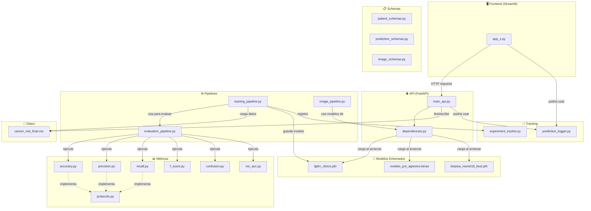
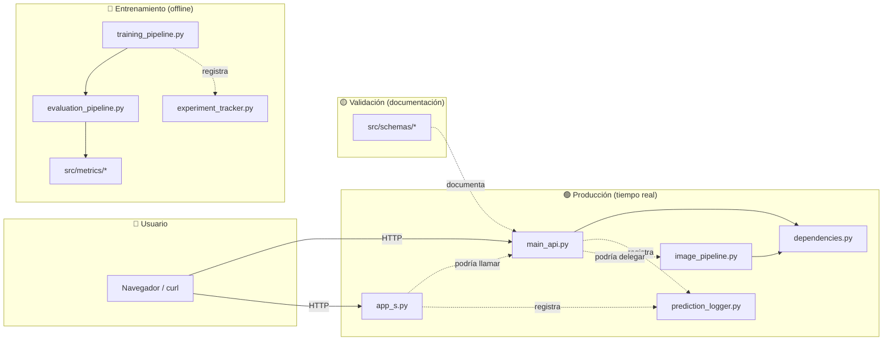

# Walkthrough: Arquitectura de los Componentes Implementados

> [!NOTE]
> Este documento explica **qué hace cada archivo**, **por qué existe** y **cómo se conecta con el resto del proyecto**. Pensado para que entiendas la lógica de la arquitectura completa.

---

## Diagrama General del Sistema



---

## 1. Carpeta `src/api/` — El Backend (Servidor HTTP)

### ¿Qué problema resuelve?

Antes, **todo estaba dentro de Streamlit**: la app de Streamlit cargaba los modelos directamente, hacía las predicciones y mostraba los resultados. Esto crea un problema fundamental: **si quieres que otro programa use tu IA** (una app móvil, otra web, un compañero de equipo), no puede, porque la IA está **atrapada** dentro de la interfaz visual.

El backend API **separa** la inteligencia artificial de la pantalla, y la expone como un **servicio** que cualquiera puede consumir.

### Analogía

Piensa en un restaurante:
- **Sin API**: El chef cocina Y te sirve la comida en la mesa. Si quieres pedir a domicilio, no puedes porque el chef solo sabe servir en mesa.
- **Con API**: El chef solo cocina (backend). Un camarero lleva la comida a la mesa (Streamlit), y un repartidor la lleva a domicilio (app móvil). El chef siempre es el mismo.

---

### 📄 `dependencies.py` — "El almacén del restaurante"

[Ver archivo](file:///c:/Users/User/Desktop/Programacion/Proyecto%202%20-%20Cancer%20colon/src/api/dependencies.py)

**¿Qué hace?** Carga los 3 modelos de IA **una sola vez** cuando el servidor arranca, y los mantiene en memoria para que todos los endpoints los compartan.

**¿Por qué existe por separado y no dentro de `main_api.py`?** Por el principio de **separación de responsabilidades**:
- `dependencies.py` = **qué** modelos hay y **cómo** se cargan
- `main_api.py` = **qué** endpoints existen y **qué** hacen con esos modelos

Si mañana cambias el modelo de biopsias de ResNet18 a EfficientNet, solo tocas `dependencies.py`. Los endpoints no cambian.

**Qué gestiona internamente:**

| Elemento | Qué es | Líneas clave |
|---|---|---|
| `_PROJECT_ROOT` | Calcula la raíz del proyecto automáticamente | L28-30 |
| `MODEL_ML_PATH`, `MODEL_CNN_PATH`, `MODEL_BIOPSY_PATH` | Rutas a los 3 modelos `.pkl`, `.keras`, `.pth` | L32-38 |
| `ML_FEATURE_NAMES` | Las 11 variables clínicas en el orden que el modelo espera | L54-66 |
| `BiopsyClassifier` | La clase PyTorch (misma arquitectura que en el entrenamiento) necesaria para cargar los pesos `.pth` | L77-91 |
| `load_ml_model()` | Carga el LightGBM con `joblib.load()` | L99-111 |
| `load_cnn_model()` | Carga la CNN con `tf.keras.models.load_model()` + parche Keras 3 | L114-140 |
| `load_biopsy_model()` | Crea una instancia de `BiopsyClassifier` y le inyecta los pesos `.pth` | L143-160 |
| `lifespan()` | Función especial de FastAPI que se ejecuta **al arrancar** y **al parar** el servidor | L168-198 |

**¿Cómo se conecta con otros programas?**
- `main_api.py` lo importa para obtener las constantes (`ML_FEATURE_NAMES`, `RISK_LEVEL_MAP`, rutas CSV) y el `lifespan`.
- `image_pipeline.py` importa `load_cnn_model()` y `load_biopsy_model()` para reutilizar la misma lógica de carga fuera de la API.

---

### 📄 `main_api.py` — "El camarero que atiende las peticiones"

[Ver archivo](file:///c:/Users/User/Desktop/Programacion/Proyecto%202%20-%20Cancer%20colon/src/api/main_api.py)

**¿Qué hace?** Define los **endpoints HTTP** (las URLs a las que se hacen peticiones) y orquesta la lógica para responderlas.

**¿Por qué existe?** Porque sin él, la única forma de usar la IA es a través de Streamlit. Con la API activa, puedes hacer:
```bash
# Desde cualquier terminal, app, o script:
curl -X POST "http://localhost:8000/api/v1/predict/risk?smoking=8&alcohol_use=5&..."
# Y te devuelve: {"risk_level": "High", "risk_score": 0.85, ...}
```

**Los 3 grupos de endpoints:**

#### Grupo 1: Predicción ML (líneas 101-186)
| Endpoint | Qué recibe | Qué hace | Qué devuelve |
|---|---|---|---|
| `POST /api/v1/predict/risk` | 11 factores clínicos del paciente | Los pasa al modelo LightGBM como un array numpy, llama a `predict_proba()` | Probabilidad por clase (Low/Medium/High), score ponderado, features usadas |

Internamente: Toma el modelo de `request.app.state.modelo_ml` (que fue cargado por `lifespan` en `dependencies.py`), construye un array `[smoking, alcohol, ..., cea]` en el orden que el modelo espera, y ejecuta `modelo.predict_proba()`.

#### Grupo 2: Análisis de Imagen (líneas 194-324)
| Endpoint | Qué recibe | Qué hace | Qué devuelve |
|---|---|---|---|
| `POST /api/v1/analyze/colonoscopy` | Imagen subida | La redimensiona a 150×150, la normaliza y la pasa por la CNN TensorFlow | Diagnóstico (pólipo/sano), confianza, heatmap Grad-CAM en base64 |
| `POST /api/v1/analyze/biopsy` | Imagen subida | La redimensiona a 224×224, la normaliza con ImageNet y la pasa por ResNet18 PyTorch | Diagnóstico (benigno/maligno), confianza, heatmap Grad-CAM en base64 |

#### Grupo 3: Gestión de Pacientes (líneas 332-513)
| Endpoint | Qué hace |
|---|---|
| `GET /api/v1/patients` | Lee el CSV `cancer_risk_final.csv` con paginación |
| `GET /api/v1/patients/{id}` | Busca un paciente por `Patient_ID` en el CSV |
| `POST /api/v1/patients` | Añade una nueva fila al CSV |
| `PUT /api/v1/patients/{id}` | Modifica campos de un paciente existente en el CSV |

**¿Cómo se conecta con otros programas?**
- Importa de `dependencies.py`: las rutas, el `lifespan`, los nombres de features.
- Usa `src/utils/gradcam_utils.py` para generar los mapas de calor.
- Lee/escribe los CSV de `src/data/raw/historial_pacientes/`.
- El frontend `app_s.py` **podría** hacer peticiones HTTP a esta API en lugar de cargar modelos directamente.

---

## 2. Carpeta `src/pipelines/` — Los Flujos Automatizados

### ¿Qué problema resuelven?

Un pipeline es como una **cadena de montaje**: encadena varios pasos que siempre se ejecutan juntos, en el mismo orden. Sin pipelines, cada vez que quieres entrenar un modelo tendrías que escribir:
1. Cargar CSV *(copiar/pegar de otro script)*
2. Separar features *(copiar/pegar)*
3. Hacer split *(copiar/pegar)*
4. Entrenar *(copiar/pegar)*
5. Evaluar *(copiar/pegar)*
6. Guardar *(copiar/pegar)*

Esto es exactamente lo que pasaba en `ml_v0.py`, `ml_v1.py`, `ml_v2.py` y `ml_v3.py`: el mismo código repetido con variaciones mínimas. Los pipelines eliminan esa duplicación.

---

### 📄 `evaluation_pipeline.py` — "El examinador de modelos"

[Ver archivo](file:///c:/Users/User/Desktop/Programacion/Proyecto%202%20-%20Cancer%20colon/src/pipelines/evaluation_pipeline.py)

**¿Qué hace?** Recibe las predicciones de un modelo y las pasa por **todas las métricas clínicas** de la carpeta `src/metrics/` de una sola vez.

**¿Por qué existe?** Porque sin él, cada vez que evalúas un modelo tendrías que escribir manualmente:
```python
acc = accuracy_score(y_test, y_pred)
prec = precision_score(y_test, y_pred)
rec = recall_score(y_test, y_pred)
f1 = f1_score(y_test, y_pred)
# ... y así para cada métrica
```

Con el pipeline, solo haces:
```python
pipeline = ModelEvaluationPipeline(metrics=[AccuracyMetric(), RecallMetric(), ...])
resultados = pipeline.evaluate_model("LightGBM", y_test, y_pred, y_proba)
```

**Funciones principales:**
| Método | Qué hace |
|---|---|
| `evaluate_model()` | Pasa un modelo por todas las métricas → devuelve `dict` de resultados |
| `evaluate_multiple()` | Lo mismo pero para varios modelos a la vez (ej: comparar RF vs XGBoost vs LightGBM) |
| `get_summary_dataframe()` | Exporta los resultados como un DataFrame de pandas (tabla) |
| `print_report()` | Imprime un informe formateado por consola |

**¿Cómo se conecta?**
- Importa `ClassificationMetricProtocol` de `src/metrics/protocols.py` (el contrato que todas las métricas cumplen).
- Es **usado por** `training_pipeline.py` (que lo invoca automáticamente después de entrenar).
- Recibe las métricas individuales de `src/metrics/` (accuracy, recall, etc.).

---

### 📄 `training_pipeline.py` — "La fábrica de modelos"

[Ver archivo](file:///c:/Users/User/Desktop/Programacion/Proyecto%202%20-%20Cancer%20colon/src/pipelines/training_pipeline.py)

**¿Qué hace?** Encapsula todo el ciclo de vida de un entrenamiento de modelo ML:

```
CSV → Seleccionar features → Split train/test → Entrenar → Evaluar → Guardar modelo + métricas
```

**¿Por qué existe?** Porque antes tenías 4 scripts (`ml_v0.py` ... `ml_v3.py`) que hacían lo mismo con variaciones. Ahora, entrenar CUALQUIER modelo nuevo se hace así:

```python
from src.pipelines.training_pipeline import TrainingPipeline
from lightgbm import LGBMClassifier

# 1. Configurar
pipeline = TrainingPipeline(csv_path="src/data/.../cancer_risk_final.csv")
pipeline.load_and_prepare()

# 2. Entrenar y evaluar
lgbm = LGBMClassifier(n_estimators=300)
results = pipeline.train_and_evaluate(lgbm, "LightGBM")

# 3. Guardar
pipeline.save_model(lgbm, "lgbm_clinico")   # → lgbm_clinico.pkl + lgbm_clinico_metrics.json
```

**Flujo interno paso a paso:**

```mermaid
flowchart LR
    A["load_and_prepare()"] --> B["Lee CSV"]
    B --> C["Selecciona 11 features"]
    C --> D["Split 80/20 con stratify"]
    D --> E["train_and_evaluate()"]
    E --> F["model.fit(X_train)"]
    F --> G["model.predict(X_test)"]
    G --> H["EvaluationPipeline ejecuta métricas"]
    H --> I["print_report()"]
    I --> J["save_model()"]
    J --> K["modelo.pkl + métricas.json"]
```



**¿Cómo se conecta?**
- **Importa** `ModelEvaluationPipeline` y todas las métricas de `src/metrics/`.
- **Lee** el CSV de `src/data/raw/historial_pacientes/`.
- **Guarda** modelos en `src/models/ml/`.
- **Podría usar** `ExperimentTracker` de `src/tracking/` para registrar el experimento (conexión futura).

---

### 📄 `image_pipeline.py` — "El radiólogo digital"

[Ver archivo](file:///c:/Users/User/Desktop/Programacion/Proyecto%202%20-%20Cancer%20colon/src/pipelines/image_pipeline.py)

**¿Qué hace?** Encapsula la lógica de análisis de imagen (colonoscopia y biopsias) en una clase limpia, desacoplada del frontend.

**¿Por qué existe?** Porque antes, la lógica de inferencia de imagen estaba **dentro** de `cargar_modelos_s.py` (un archivo de utils de Streamlit). Esto significaba que:
- No podías usar la IA de imagen sin Streamlit
- La lógica de negocio (¿cómo se diagnostica?) estaba mezclada con la presentación (HTML inline)

Ahora la lógica está aislada en el pipeline, y tanto la API (`main_api.py`) como el frontend (`app_s.py`) pueden usarla.

**Estructura clave:**

```python
@dataclass
class ImageAnalysisResult:     # ← Resultado estandarizado para CUALQUIER imagen
    diagnosis: str             # "POLIPO DETECTADO" o "BENIGNO"
    is_positive: bool          # True si hay hallazgo
    confidence: float          # 0.92
    raw_prediction: float      # 0.23 (valor crudo del modelo)
    recommendation: str        # "Se recomienda revisión..."
    heatmap: np.ndarray        # Imagen Grad-CAM
```

| Método | Qué hace |
|---|---|
| `analyze_colonoscopy(img_array)` | Redimensiona a 150×150 → preprocesa con MobileNetV2 → predice con CNN TF → genera Grad-CAM |
| `analyze_biopsy(img_array)` | Redimensiona a 224×224 → normaliza ImageNet → predice con ResNet18 PyTorch → genera Grad-CAM |

**¿Cómo se conecta?**
- **Importa** `load_cnn_model()` y `load_biopsy_model()` de `dependencies.py` (carga lazy: solo carga la primera vez que se necesita).
- **Usa** `src/utils/gradcam_utils.py` para generar los mapas de calor.
- Podría ser **consumido por** `main_api.py` (actualmente la API tiene su propia lógica inline, pero podría delegar al pipeline).
- Podría ser **consumido por** `app_s.py` (en lugar de usar `cargar_modelos_s.py` directamente).

---

## 3. Carpeta `src/schemas/` — Los Contratos de Datos

### ¿Qué problema resuelven?

Sin schemas, la API acepta **cualquier cosa**. Si alguien envía `bmi="gordo"` en lugar de `bmi=32.5`, el servidor explota con un error críptico de numpy. Los schemas **validan automáticamente** que los datos sean correctos ANTES de que lleguen a la lógica del modelo.

### Analogía

Un schema es como un **formulario de papel** que tiene casillas con restricciones:
- "Edad: _____ (solo números, entre 0 y 120)"
- "Género: ◯ Male ◯ Female" (solo estas opciones)

Si escribes algo que no encaja, el formulario te lo rechaza antes de enviarlo.

---

### 📄 `patient_schemas.py` — "El formulario del paciente"

[Ver archivo](file:///c:/Users/User/Desktop/Programacion/Proyecto%202%20-%20Cancer%20colon/src/schemas/patient_schemas.py)

**¿Qué hace?** Define la estructura de datos de un paciente con validaciones Pydantic.

| Schema | Cuándo se usa | Ejemplo |
|---|---|---|
| `PatientCreate` | Al crear un paciente nuevo (POST) | Requiere `patient_id` obligatorio + todos los factores clínicos |
| `PatientUpdate` | Al actualizar uno existente (PUT) | Todos los campos son **opcionales** (solo cambias lo que quieras) |
| `PatientResponse` | Al devolver datos al frontend | Incluye todos los campos + `risk_level_n` calculado |
| `PatientListResponse` | Al devolver una lista paginada | `{total: 5000, skip: 0, limit: 50, patients: [...]}` |

**Validaciones automáticas** (líneas 15-26): cada campo tiene `ge` (greater or equal) y `le` (less or equal):
```python
smoking: int = Field(0, ge=0, le=10)      # Solo acepta 0-10
bmi: float = Field(25.0, ge=10, le=60)    # Solo acepta 10-60
family_history: int = Field(0, ge=0, le=1) # Solo acepta 0 o 1
```

---

### 📄 `prediction_schemas.py` — "El formulario de la predicción"

[Ver archivo](file:///c:/Users/User/Desktop/Programacion/Proyecto%202%20-%20Cancer%20colon/src/schemas/prediction_schemas.py)

**¿Qué hace?** Define qué datos necesita el endpoint de predicción y qué formato tiene la respuesta.

| Schema | Dirección | Contenido |
|---|---|---|
| `RiskPredictionRequest` | **Entrada** → API | Los 11 factores clínicos con validaciones |
| `RiskPredictionResponse` | API → **Salida** | `risk_level`, `risk_score`, `probabilities` (Low/Medium/High) |
| `SHAPExplanation` | API → **Salida** | Explicación de una variable: `{feature: "Smoking", impact: 23.5%, direction: "Sube riesgo"}` |
| `SHAPResponse` | API → **Salida** | Lista completa de explicaciones SHAP para una predicción |

---

### 📄 `image_schemas.py` — "El formulario del informe radiológico"

[Ver archivo](file:///c:/Users/User/Desktop/Programacion/Proyecto%202%20-%20Cancer%20colon/src/schemas/image_schemas.py)

**¿Qué hace?** Estandariza la respuesta de los endpoints de análisis de imagen.

| Schema | Campos |
|---|---|
| `ImageAnalysisResponse` | `diagnosis`, `is_positive`, `confidence`, `raw_prediction`, `recommendation`, `gradcam_base64` |
| `ColonoscopyAnalysisResponse` | Extiende el anterior + `analysis_type="colonoscopy"` + `is_polyp` |
| `BiopsyAnalysisResponse` | Extiende el anterior + `analysis_type="biopsy"` + `is_benign` |

**¿Cómo se conectan los 3 schemas con el resto?**
- La API (`main_api.py`) **podría usar** estos schemas como `response_model` en los endpoints para auto-documentar la API y validar las respuestas.
- FastAPI genera automáticamente documentación Swagger desde los schemas (accesible en `http://localhost:8000/docs`).
- Cualquier programa que consuma la API sabe **exactamente** qué formato esperar en las respuestas.

---

## 4. Carpeta `src/tracking/` — La Memoria del Proyecto

### ¿Qué problema resuelven?

Sin tracking, cada vez que entrenas un modelo:
1. Las métricas se imprimen por consola → **se pierden al cerrar la terminal**.
2. No sabes qué hiperparámetros usaste hace 3 días.
3. No puedes comparar si el modelo de hoy es mejor que el de ayer.
4. No hay registro de qué predicciones se han hecho (importante en medicina).

---

### 📄 `experiment_tracker.py` — "El cuaderno de laboratorio"

[Ver archivo](file:///c:/Users/User/Desktop/Programacion/Proyecto%202%20-%20Cancer%20colon/src/tracking/experiment_tracker.py)

**¿Qué hace?** Guarda **cada entrenamiento** como un registro en un archivo JSON (`experiments.json`) con toda la información necesaria para reproducirlo.

**Ejemplo de un registro guardado:**
```json
{
  "a3f2b8c1": {
    "model_name": "LightGBM",
    "timestamp": "2026-04-07T23:15:00",
    "metrics": {
      "Accuracy": 0.8534,
      "Recall (macro)": 0.9102,
      "F2-Score (macro)": 0.8891
    },
    "hyperparameters": {
      "n_estimators": 300,
      "learning_rate": 0.02
    },
    "features": ["Smoking", "Alcohol_Use", "BMI", ...],
    "dataset_path": "cancer_risk_final.csv",
    "model_path": "src/models/ml/lgbm_clinico.pkl",
    "train_size": 4000,
    "test_size": 1000,
    "notes": "Entrenamiento con datos limpios v3"
  }
}
```

| Método | Qué hace |
|---|---|
| `log_experiment()` | Registra un nuevo entrenamiento con métricas, hiperparámetros, features, etc. |
| `get_best_experiment("Recall")` | Busca cuál fue el entrenamiento con mejor Recall de todos los registrados |
| `summary()` | Imprime una tabla resumen de todos los experimentos |

**¿Cómo se conecta?**
- `training_pipeline.py` **podría** llamar a `tracker.log_experiment()` al final de cada entrenamiento.
- Un dashboard en Streamlit **podría** leer `experiments.json` y mostrar una comparativa visual de modelos.

---

### 📄 `prediction_logger.py` — "El historial clínico digital"

[Ver archivo](file:///c:/Users/User/Desktop/Programacion/Proyecto%202%20-%20Cancer%20colon/src/tracking/prediction_logger.py)

**¿Qué hace?** Registra **cada predicción** que se hace en producción (ya sea desde la API o Streamlit) en un CSV (`predictions.csv`).

**¿Por qué es importante?** En un contexto médico, necesitas **trazabilidad**:
- ¿Qué paciente fue analizado?
- ¿Cuándo se hizo la predicción?
- ¿Qué resultado dio el modelo?
- ¿Con qué confianza?

Si un médico pregunta "¿qué dijo el sistema sobre el paciente 42?", puedes buscar en el log.

**Ejemplo del CSV generado (`predictions.csv`):**

| timestamp | prediction_type | patient_id | diagnosis | confidence | risk_score | risk_level | details |
|---|---|---|---|---|---|---|---|
| 2026-04-08T13:00:00 | risk_ml | 42 | Riesgo: High | 0.91 | 0.85 | High | {Smoking: 8, BMI: 32} |
| 2026-04-08T13:01:30 | image_colonoscopy | | POLIPO DETECTADO | 0.88 | | | image: colon_03.jpg |
| 2026-04-08T13:02:15 | image_biopsy | 42 | BENIGNO | 0.95 | | | image: upload |

| Método | Qué hace |
|---|---|
| `log_risk_prediction()` | Registra una predicción de riesgo ML con todos los datos del paciente |
| `log_image_prediction()` | Registra un análisis de imagen (colonoscopia o biopsia) |
| `get_history(limit=100)` | Lee las últimas N predicciones del log |
| `get_stats()` | Estadísticas: cuántas predicciones, desglose por tipo y diagnóstico |

**¿Cómo se conecta?**
- `main_api.py` **podría** llamar al logger después de cada predicción exitosa.
- `app_s.py` **podría** llamar al logger para registrar las predicciones del frontend.
- Un dashboard **podría** usar `get_stats()` para mostrar estadísticas de uso.

---

## Resumen: ¿Quién llama a quién?



> [!TIP]
> **Clave para entender la arquitectura**: Hay dos mundos separados:
> 1. **Producción** (derecha): API + Streamlit + image_pipeline + prediction_logger → se ejecutan cuando un usuario hace predicciones.
> 2. **Entrenamiento** (izquierda): training_pipeline + evaluation_pipeline + metrics + experiment_tracker → se ejecutan cuando tú entrenas modelos nuevos.
>
> Los **schemas** son documentación viva que valida los datos en ambos mundos.
